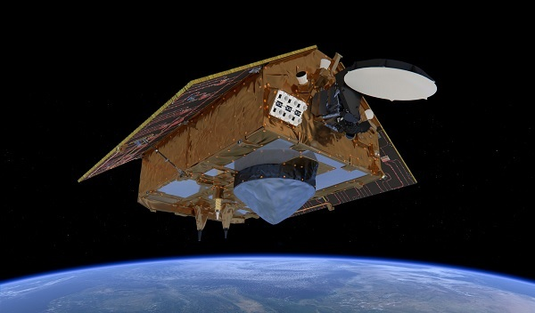
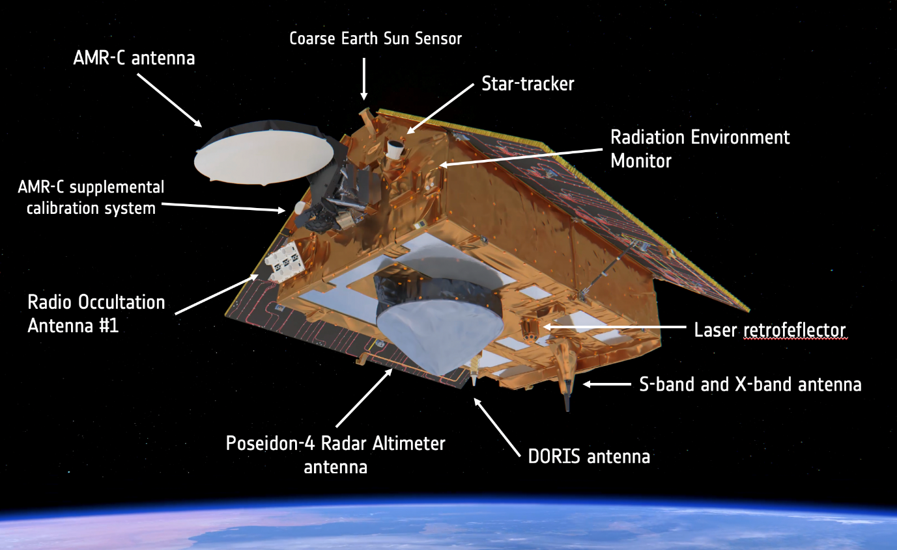

```{r setup, include=FALSE}
options(htmltools.dir.version = FALSE)
# xaringan:::list_css()
```

```{r xaringan-all, echo=FALSE}
library(countdown)
library(xaringan)
library(xaringanExtra)
library(knitr)
hook_source <- knitr::knit_hooks$get('source')
knitr::knit_hooks$set(source = function(x, options) {
  x <- stringr::str_replace(x, "^[[:blank:]]?([^*].+?)[[:blank:]]*#<<[[:blank:]]*$", "*\\1")
  hook_source(x, options)
})
xaringanExtra::use_broadcast()
xaringanExtra::use_freezeframe()
xaringanExtra::use_scribble()
#xaringanExtra::use_slide_tone()
xaringanExtra::use_search(show_icon = TRUE, auto_search	=FALSE)
xaringanExtra::use_freezeframe()
xaringanExtra::use_clipboard()
xaringanExtra::use_tile_view()
xaringanExtra::use_panelset()
xaringanExtra::use_editable(expires = 1)
xaringanExtra::use_fit_screen()
xaringanExtra::use_extra_styles(
  hover_code_line = TRUE,         
  mute_unhighlighted_code = TRUE  
)
```

class: center, title-slide, middle

background-image: url("img/CASA_Logo_no_text_trans_17.png")
background-size: cover
background-position: center


<style>
.title-slide .remark-slide-number .my-style {
  my-style[display: white;]
}
</style>
```{r load_packages, message=FALSE, warning=FALSE, include=FALSE}
library(fontawesome)
```

# Presenting Sentinel 6A with specific focus on Poseidon-4 radar Altimeter

### Week 2

`r fa("paper-plane", fill = "#562457")` [stnvvrt@ucl.ac.uk](mailto:stnvvrt@ucl.ac.uk)
`r fa("github", fill = "#562457")` [vtesniere](https://github.com/vtesniere)
`r fa("location-dot", fill = "#562457")` [Department of Geography](https://www.geog.ucl.ac.uk/) .my-style[&] [Centre for Advanced Spatial Analysis, UCL](https://www.ucl.ac.uk/bartlett/casa/)
`r fa("file-pdf", fill = "#562457")` [PDF presentation](https://github.com/vtesniere/CASA0023_presentation_week2)


<a href="https://github.com/vtesniere" class="github-corner" aria-label="View source on GitHub"><svg width="80" height="80" viewBox="0 0 250 250" style="fill:#fff; color:#151513; position: absolute; top: 0; border: 0; left: 0; transform: scale(-1, 1);" aria-hidden="true"><path d="M0,0 L115,115 L130,115 L142,142 L250,250 L250,0 Z"></path><path d="M128.3,109.0 C113.8,99.7 119.0,89.6 119.0,89.6 C122.0,82.7 120.5,78.6 120.5,78.6 C119.2,72.0 123.4,76.3 123.4,76.3 C127.3,80.9 125.5,87.3 125.5,87.3 C122.9,97.6 130.6,101.9 134.4,103.2" fill="currentColor" style="transform-origin: 130px 106px;" class="octo-arm"></path><path d="M115.0,115.0 C114.9,115.1 118.7,116.5 119.8,115.4 L133.7,101.6 C136.9,99.2 139.9,98.4 142.2,98.6 C133.8,88.0 127.5,74.4 143.8,58.0 C148.5,53.4 154.0,51.2 159.7,51.0 C160.3,49.4 163.2,43.6 171.4,40.1 C171.4,40.1 176.1,42.5 178.8,56.2 C183.1,58.6 187.2,61.8 190.9,65.4 C194.5,69.0 197.7,73.2 200.1,77.6 C213.8,80.2 216.3,84.9 216.3,84.9 C212.7,93.1 206.9,96.0 205.4,96.6 C205.1,102.4 203.0,107.8 198.3,112.5 C181.9,128.9 168.3,122.5 157.7,114.1 C157.9,116.9 156.7,120.9 152.7,124.9 L141.0,136.5 C139.8,137.7 141.6,141.9 141.8,141.8 Z" fill="currentColor" class="octo-body"></path></svg></a><style>.github-corner:hover .octo-arm{animation:octocat-wave 560ms ease-in-out}@keyframes octocat-wave{0%,100%{transform:rotate(0)}20%,60%{transform:rotate(-25deg)}40%,80%{transform:rotate(10deg)}}@media (max-width:500px){.github-corner:hover .octo-arm{animation:none}.github-corner .octo-arm{animation:octocat-wave 560ms ease-in-out}}</style>

---

# How will we present Poseidon and what aims of this presention are!

.center2[
- Background information on the Platform of the sensor Sentinel-6A

  - Orbital and Technical Specifications

  - Stake Holders and parties involved

- Understanding what Poseidon does and who it benefits

- Visualising how the Sensor works
]

---

# What exactly is Sentinel 6A?

.pull-left[.milieu[.center[  .small[
[Source and additional information: ESA Sentinel website](https://sentinels.copernicus.eu/web/sentinel/missions/sentinel-6)]
]]]
.center[ .low[ The completion of this project is the **illustration of the success of international collaboration in International Spatial Research!**]]

.pull-right[
**Key Facts**
- Sentinel 6 part of the Coperinus Programme with the aim of providing in-depth data regarding sea-surface height measurements 

- Main control is lead by [EUMETSAT](https://www.eumetsat.int/) which is Europe's principal weather and climate satellite organisation

- Full name of platform: Sentinel-6A Michael Freilich - named after American Oceanographer [Michael Freilich](https://en.wikipedia.org/wiki/Michael_Freilich_(oceanographer)) which was an important player in facilitating collaboration between international institutions

- NASA, EUMESTAT, ESA, European commission, CNES (french spatial research center) all played an important role in the success of the project
]

---

# Technical details on Sentinel 6-A and it's Orbit

.pull-right[.milieu2[.center[

.small[[Animated GIF of the Sentinel 6A orbit, provided by ESA](https://climate.nasa.gov/climate_resources/238/animated-gif-sentinel-6-michael-freilich/)
]]]]

.pull-left[
.panelset[
.panel[ .panel-name[Mission Details]

- Twin mission: with 6A and 6B

- 6A launched on 21st November 2020
  
- 6B to be launched in 2025
  
- 5.5 year mission duration estimation

- Entered Service 21 June 2021

- Launched By SpaceX

- Launched in California USA

- Total Cost to Launch estimated to be approximately [100 million](https://www.nasa.gov/press-release/nasa-awards-launch-services-contract-for-sentinel-6a-mission)

]

.panel[ .panel-name[Orbital information]

- Geocentric Orbit (orbits around Earth)

- Orbit Altitude: 1336 km

- Revisit Time: 10 Days

- Mass: 1192 kg at time of launch

- Inclination: 66.0°

- 6 different instruments available

- Dimensions: 5.13 x 4.17 x 2.34 m

]
]
]

---

class: inverse, center, middle

# A break-down of instruments on available on the platform

--

### DORIS

### AMR-C

### LRA

### GNSS POD

### GNSS RO

### POSEIDON-4 ALTIMETER

---
.center[
```{r, echo=FALSE, out.width="70%"}

```
]
.panelset[

.panel[
.panel-name[DORIS]

- Stands for Doppler Orbtigraphy and Radio-positioning Integrated by Satellite

- Uses two different stable radio frequencies to precisely determine its line-of-sight velocity [Source](https://www.jpl.nasa.gov/news/press_kits/sentinel-6/mission/spacecraft/#:~:text=Each%20ground%20station%20acts%20as,line-of-sight%20velocity.)

]

.panel[
.panel-name[AMR-C]

- Advanced Microwave Radiometer

- 
]
]

---
